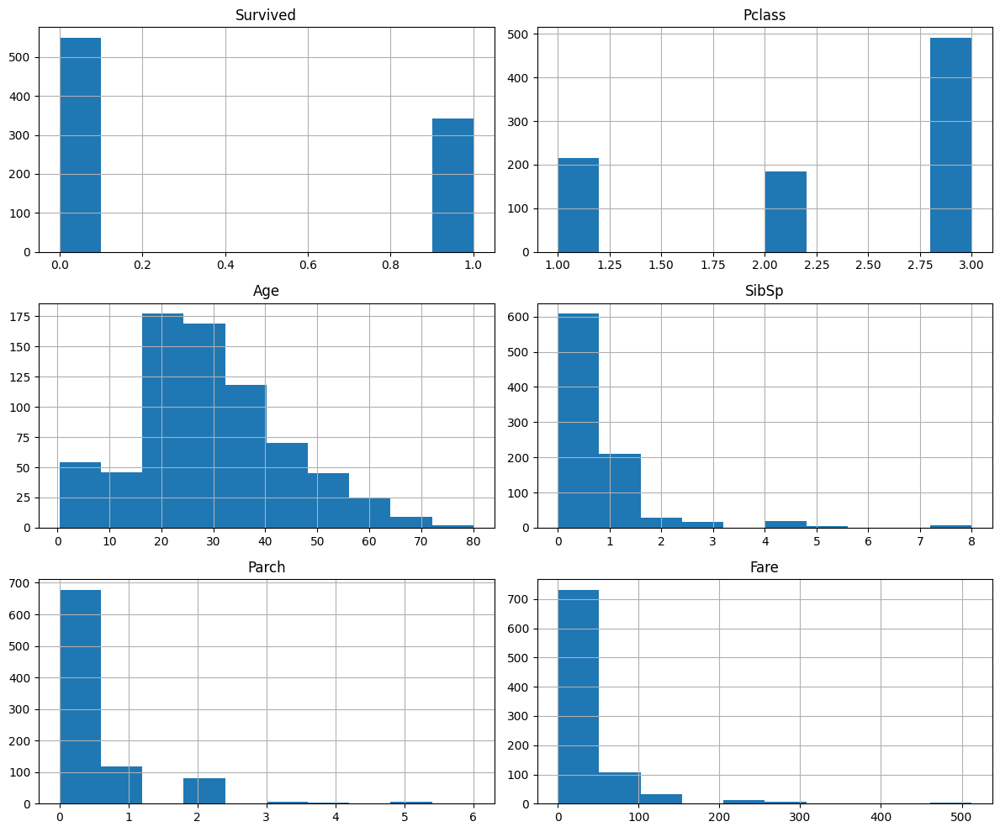
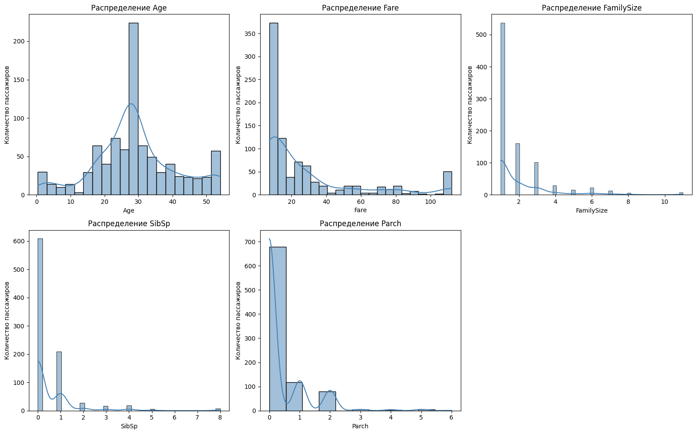
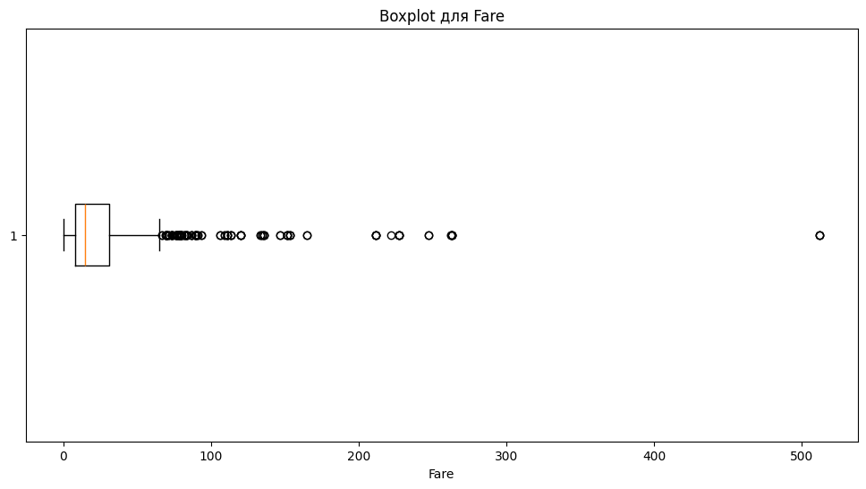
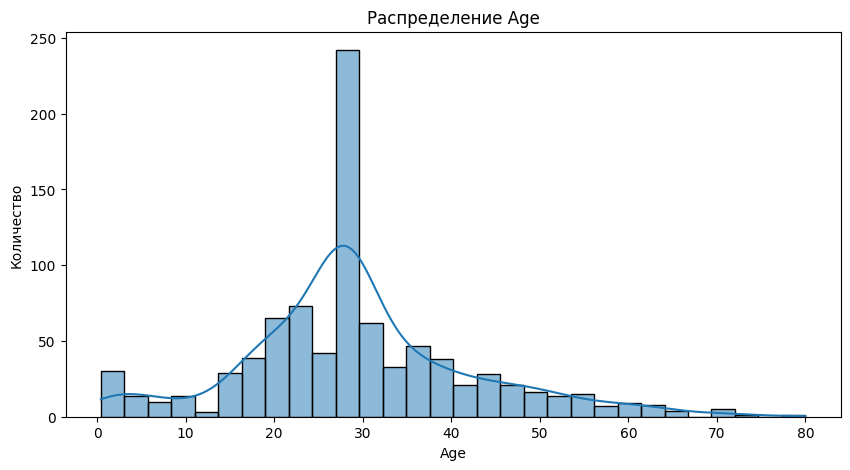
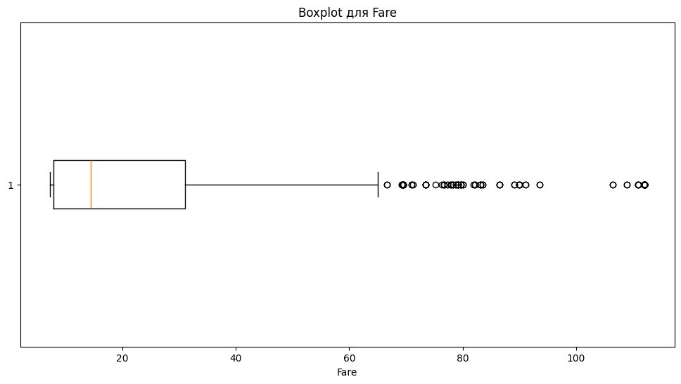
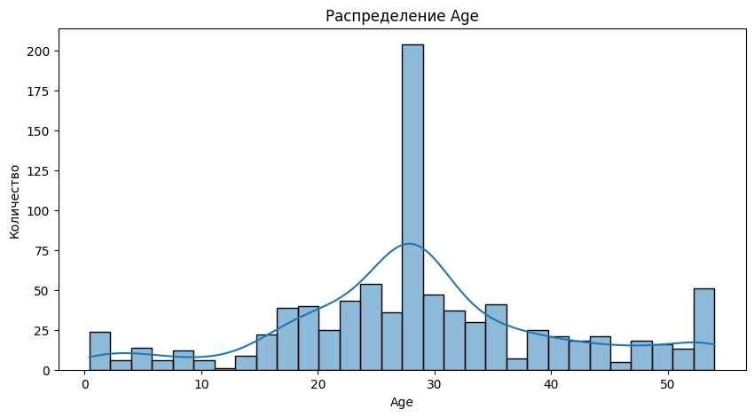
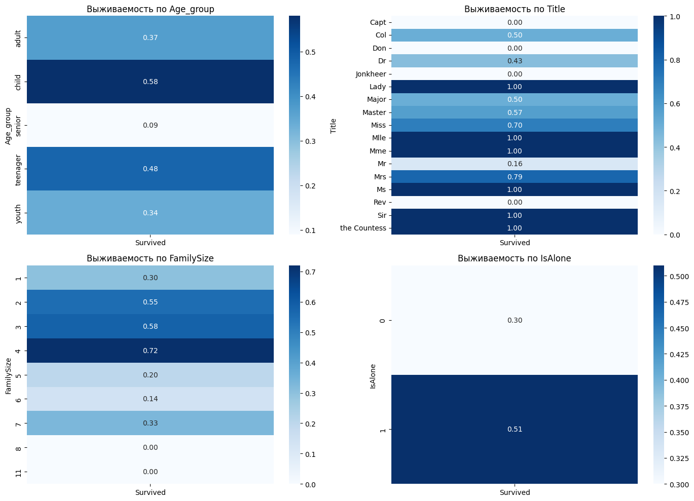
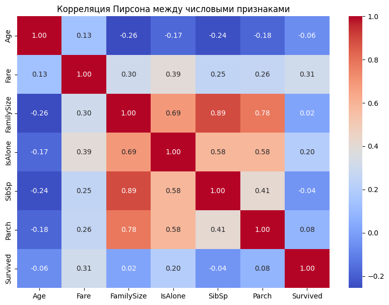
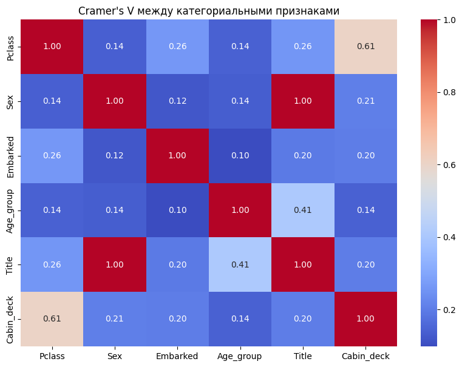

# Лабораторная работа №6
## Очистка и трансформация данных. pandas (P3123)

**Выполнил:** Пушкин Иван Алексеевич, группа P3123

---

## 1. Введение

Данная лабораторная работа посвящена изучению методов очистки и трансформации данных с использованием библиотеки pandas на примере реального датасета Titanic с платформы Kaggle.

---

## 2. Цель работы

Освоение методов очистки и трансформации данных с использованием библиотеки pandas на примере реальных данных из Kaggle.

---

## 3. Теоретические сведения

Основные понятия:

- **Предобработка данных** — подготовка данных к анализу
- **Очистка данных** — устранение ошибок и пропусков
- **Трансформация данных** — преобразование данных для анализа
- **Pandas** — библиотека для работы с данными в Python

---

## 4. Описание набора данных

**Dataset:** Titanic ([https://www.kaggle.com/c/titanic/data](https://www.kaggle.com/c/titanic/data))

| Признак | Описание |
|---|---|
| PassengerId | Идентификатор пассажира |
| Survived | Выжил ли пассажир (0 = нет; 1 = да) |
| Pclass | Класс билета |
| Name | Имя |
| Sex | Пол |
| Age | Возраст |
| SibSp | Количество братьев/сестёр/супругов на борту |
| Parch | Количество родителей/детей на борту |
| Ticket | Номер билета |
| Fare | Стоимость билета |
| Cabin | Номер каюты |
| Embarked | Порт посадки |

---

## 5. Первичный анализ

### Статистика датафрейма

После загрузки данных были выведены первые 10 строк, типы данных и статистические характеристики числовых признаков (`train.describe()`).

Основные наблюдения:
- Всего **891 пассажир** и **12 признаков**
- Числовые типы: `int64` и `float64`
- Строковые типы: `object`

### Визуализация пропусков

Выявленные пропуски:

| Столбец | Количество пропусков |
|---|---|
| Age | 177 |
| Cabin | 687 |
| Embarked | 2 |

### Гистограммы распределения числовых признаков

---

## 6. Обработка пропусков

### Методы заполнения

**Age:** среднее значение — ~29.7, медиана — 28.0. Пропуски заполнены **медианой**, так как она устойчива к выбросам.

**Embarked:** наиболее часто встречающееся значение — `S` (Southampton). Два пропуска заполнены **модой**.

**Cabin:** столбец содержит ~77% пропусков. Из первой буквы каюты создан новый признак `Cabin_deck` (палуба). Пассажирам без каюты присвоено значение `U` (Unknown). Исходный столбец удалён.

### Результаты обработки

После обработки пропусков в датасете не осталось ни одного пустого значения.

---

## 7. Трансформация данных

### Созданные признаки

| Признак | Описание |
|---|---|
| Age_group | Возрастная группа: Child / Teenager / Youth / Adult / Senior |
| Title | Обращение из имени: Mr, Mrs, Miss и т.д. |
| FamilySize | Размер семьи = SibSp + Parch + 1 |
| IsAlone | 1 — путешествует один, 0 — с семьёй |
| Cabin_deck | Палуба из первой буквы каюты |

Возрастные группы:
- 0–12: Child
- 13–17: Teenager
- 18–25: Youth
- 26–64: Adult
- 65+: Senior

### Преобразования типов

- `Pclass`: числовой → строковый (1→F, 2→S, 3→T)
- `Sex`: строковый → числовой (male→0, female→1)
- `Title`: извлечён из `Name` с помощью регулярного выражения

### Распределение числовых признаков после трансформации

---

## 8. Обработка выбросов

### Выявленные выбросы

Для признака `Fare` построен boxplot. С помощью IQR-метода выявлено значительное количество выбросов — некоторые пассажиры первого класса платили до 512$.

IQR-метод: Q1 = 7.91, Q3 = 31.0, IQR = 23.09, верхняя граница = 65.6

**Boxplot для Fare до обработки:**

**Распределение Age до обработки:**

### Методы обработки

- **Winsorization для Fare:** обрезка до 5-го и 95-го перцентиля
- **Clip для Age:** значения выше 95-го перцентиля заменены на граничное значение

**Boxplot для Fare после обработки:**

**Распределение Age после обработки:**

После обработки распределения стали значительно равномернее, экстремальные значения устранены.

---

## 9. Агрегация и анализ

### Сводные статистики

**Среднее выживание по классам:**

| Класс | Доля выживших |
|---|---|
| F (1-й) | ~0.63 |
| S (2-й) | ~0.47 |
| T (3-й) | ~0.24 |

**Медианный возраст по портам посадки:**

| Порт | Медианный возраст |
|---|---|
| C (Cherbourg) | ~30 |
| Q (Queenstown) | ~22 |
| S (Southampton) | ~28 |

### Визуализации выживаемости по новым признакам

Основные наблюдения:
- **Age_group:** дети (0.58) выживали чаще взрослых и пожилых (0.09)
- **Title:** женские обращения (Miss — 0.70, Mrs — 0.79, Lady/Ms/Mme — 1.0) показали высокую выживаемость; Mr — лишь 0.16
- **FamilySize:** семьи из 2–4 человек выживали чаще одиночек (0.30) и больших семей
- **IsAlone:** одиночки (0.30) выживали реже тех, кто был с семьёй (0.51)

---

## 10. Метрики качества очистки данных

- **Процент заполненных значений:** 100% по всем столбцам после обработки
- **Уникальные значения в категориальных признаках:** Age_group — 5, Title — 17, Pclass — 3, Embarked — 3, Cabin_deck — 9

### Корреляция Пирсона (числовые признаки)

Сильные связи:
- `SibSp` и `FamilySize` (r = 0.89) — братья/сёстры входят в размер семьи
- `Parch` и `FamilySize` (r = 0.78) — аналогично для родителей/детей
- `Fare` и `Survived` (r = 0.31) — более дорогие билеты связаны с выживаемостью

### Cramer's V (категориальные признаки)

Сильные связи:
- `Title` и `Sex` (V = 1.0) — обращение полностью определяется полом
- `Pclass` и `Cabin_deck` (V = 0.61) — класс билета определяет палубу
- `Age_group` и `Title` (V = 0.41) — возрастная группа связана с обращением

---

## 11. Заключение

### Результаты работы

В ходе лабораторной работы проведён полный цикл предобработки данных:
- Загружен датасет Titanic (891 пассажир, 12 признаков)
- Заполнены пропуски в Age и Embarked; из Cabin создан признак Cabin_deck
- Создано 5 новых признаков: Age_group, Title, FamilySize, IsAlone, Cabin_deck
- Обработаны выбросы в Fare и Age методом winsorization
- Проведена агрегация и построены сводные таблицы выживаемости
- Вычислены корреляции Пирсона и Cramer's V

### Выводы

Наибольшее влияние на выживаемость оказывали пол, класс билета и размер семьи. Женщины и пассажиры первого класса выживали значительно чаще. Пассажиры, путешествовавшие в одиночку, выживали реже тех, кто был с семьёй среднего размера (2–4 человека). Высокая корреляция между SibSp/Parch и FamilySize подтверждает, что новый признак успешно объединяет информацию о родственниках на борту.

---

**Ссылка на ноутбук:** [Открыть в Google Colab](https://colab.research.google.com/drive/1CvJi8jzZl3mlEcQdJAr1xHeUsm3gfQF0?usp=sharing)